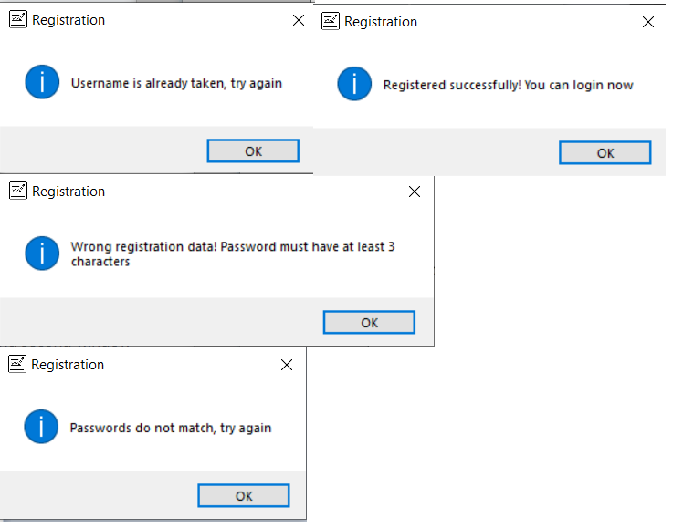
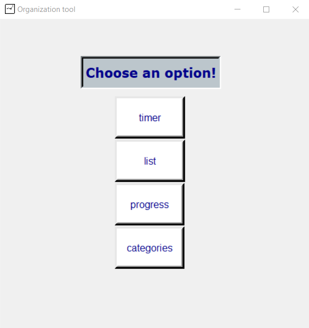

# organization-tool
Python application that helps with time management - currently in progress

## Table of contents
* [General info](#general-info)
* [Technologies](#technologies)
* [Functionalities](#functionalities)
* [Progress](#progress)

## General info
This project is supposed to allow user to track work progress and organize time.
	
## Technologies
Project is created with:
* Python version: 3.9

## Functionalities
- GUI made with tkinter library
- Login window
- Window with task organizer
- User customized application (for each user there are specified tasks and categories) 

## Progress
- Login functionality - based on txt file

     

- Register as new user

	</img>

Possible outcomes:

	</img>

- Part of user window

	</img>

